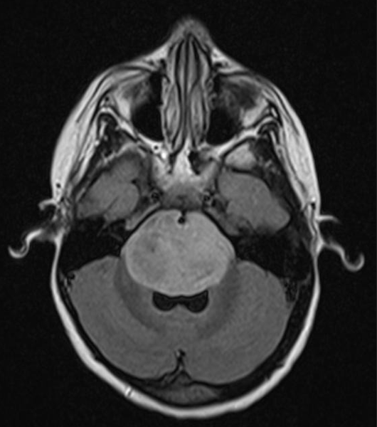
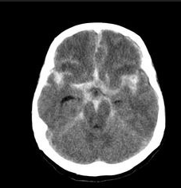
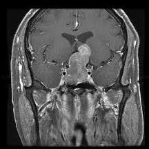
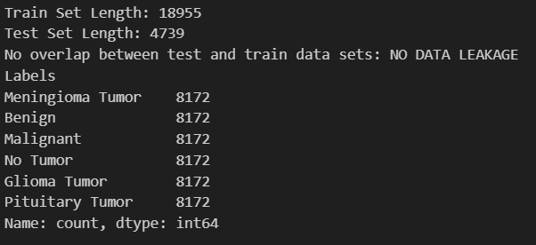

# Brain Dataset and Breast Dataset Combined to Create a Multi-Modal Model

## Dataset Summary
- **23,694 MRI images**
- **6 diagnostic categories**
- Multi-site, multi-modal MRI slices (brain + breast)

---

## Class Distributions (Pre-Balancing)

---

## Sample Images

**Glioma Tumor**  

**Meningioma Tumor**  

**No Tumor**  

**Pituitary Tumor**  

---

## Train/Test Integrity

Initial filesystem checks showed **no overlapping file paths**, indicating no leakage  

However, **pixel-level comparison revealed minor duplication** between train and test sets  

> **Impact:** Leakage was minimal and reduced validation accuracy by approximately **1–2%**,  
> meaning model conclusions remain directionally accurate but not fully leakage-free.

---

## Known Limitations
- Cross-scanner variance (magnetic strength, manufacturer, protocol differences)
- Original class imbalance prior to balancing
- Mixed-modality dataset can cause models to **separate modality before pathology**
  (mitigated using earlier-layer Grad-CAM & IG)

---
